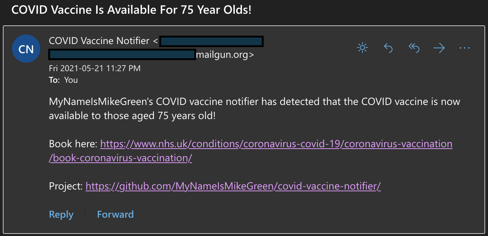

COVID Vaccine Notifier
=====================

* Detects the NHS's current age threshold for non-priority COVID vaccination.
* Compares this to the user's age.
* If the user is eligible for the vaccine according to the current rollout plan, sends a notification email.

# Usage

* Create a [Mailgun](https://www.mailgun.com/) account.
* Set the following environment variables:
    * **TARGET_AGE**: Age of the user
    * **RECIPIENT**: Email address to notify
    * **MAILGUN_API_KEY**: API key for the Mailgun account to send notification email from
    * **MAILGUN_DOMAIN**: Maingun sending domain to send email from
* Run `./run.sh`
    * Ideally, this will be run periodically with a scheduler
